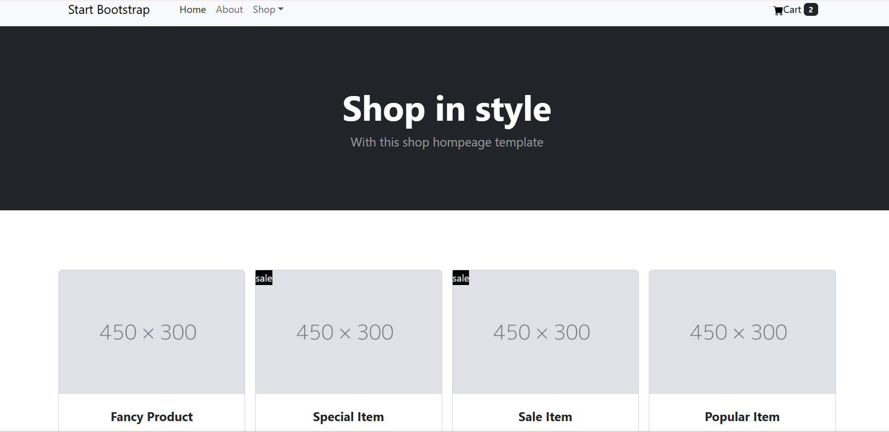
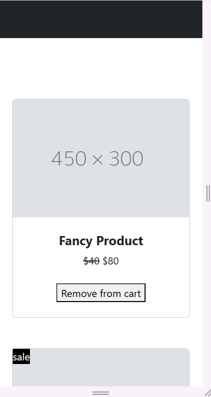

# 🛍️ shopping-cart

A simple React-based e-commerce product display page featuring a navigation bar, header, product cards with add/remove cart functionality, and a footer.  
Built using **React**, **Bootstrap**, and **functional components**.

---

## 🚀 Features

- Add/Remove items from cart
- Dynamic product listing
- React functional components with `useState`
- Prop validation with `prop-types`
- Bootstrap for responsive UI

---

## 📸 Screenshots

💻 Desktop View :




📱 Mobile View:





--- 

## 📦 Project Structure
shopping-cart/
├──src
│ ├── components/
│ ├── Content.jsx
│ ├── Footer.jsx
│ ├── Header.jsx
│ └── Navbar.jsx
├── images/
│ └── images1.jpg
├── App.jsx
├── index.css
├── main.jsx
└── README.md

---

## 🔧 Usage

1. Browse the product list displayed on the homepage.

2. Click Add to Cart to add an item.

3. Click Remove from Cart to remove an item.

4. The cart updates dynamically as you add or remove products.

---

## 🚀 Getting Started
🔹 Clone the repo
```bash
git clone https://github.com/Elanthiran/shopping-cart.git
cd shopping-cart
```
---
## Install dependencies:
```bash
* npm install
```


## Start the development server:
```bash
* npm run dev
```

## 🛠 Tech Stack
- React
- Bootstrap 5
- Vite
- PropTypes

---

## 💡 Future Improvements
- Add global cart state (Context API or Redux)
- Product filtering/search feature
- Persist cart in local storage
- Connect to backend/API for real data

--- 

## 📃 License
This project is licensed under the MIT License.


